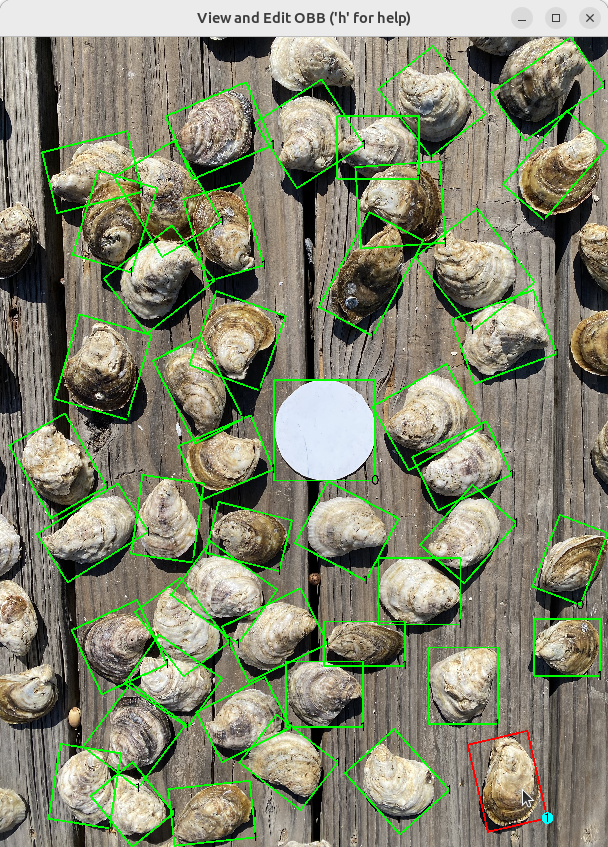
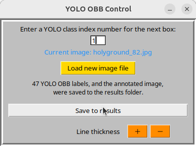

# Project: draw-yolo-obb
<br/>
<br/>

|            View existing object detection labels            |             Edit and export as YOLO OBB labels             |
|:-----------------------------------------------------------:|:----------------------------------------------------------:|
|  |  |

<p align="center">
Draw boxes from scratch or import YOLO object detection labels, then edit and export as labels for Ultralytics yolo-obb models.
</p>

## Table of Contents
* [Overview](#Overview)
* [Requirements](#Requirements)
* [Usage](#Usage)
* [Screenshots](#Screenshots)
* [Tips](#Tips)
* [Known Issues](#Known-Issues)
* [Attributions](#Attributions)

### Overview:

This Python3 script draws oriented bounding boxes (rotated bounding boxes, OBB) for objects in an image. It can be used to view boxes from existing YOLO labels files, draw new OBB boxes, and save results to a labels text file ready for yolo-obb model training with the Ultralytics package. The program is designed to be easy to use, with a simple interface for drawing boxes and editing their properties with the mouse and keyboard.

The script is executed from the command line on Linux and Windows platforms.

### Requirements:
`draw-yolo-obb.py` requires the OpenCV and NumPy packages. Tkinter (Tk/Tcl) is also needed, but is most likely already included in your Python distribution. The required packages can be installed using pip. Installing opencv-python also installs the compatible version of NumPy. It is recommended to use a virtual environment to avoid version conflicts with other packages. While optional, the commands for that are included below for using the `venv` module and a new virtual environment named `cvvenv`. You can name the environment anything you like. 
```bash
python3 -m venv cvvenv
source cvvenv/bin/activate
python3 -m pip install --update pip
python3 -m pip install opencv-python
```
or, on Windows:
```bash
py -m venv cvvenv
cvvenv\Scripts\activate 
py -m pip install --update pip
py -m pip install opencv-python
```

Program development environments were Linux Ubuntu 24.04 with Python 3.12 and Windows 11 with Python 3.11.

### Usage:

From GitHub either clone the repository:
```bash
https://github.com/csecht/draw-yolo-obb.git
```
or download the zip file:`
```bash
https://github.com/csecht/draw-yolo-obb/archive/refs/heads/main.zip
```

To run, from a terminal window opened from the downloaded draw_yolo_obb_main folder (and from within the cvvenv environment, as described above), enter:
```bash
python3 -m draw-yolo-obb
```
or, on Windows:
```bash
py -m draw-yolo-obb
```

The script will load a sample image at startup. Use the `Load new image file` button on the YOLO OBB Control window to select any JPEG or PNG file. For ease of navigation, it is most convenient to copy images that you want to annotate into the program's downloaded `images` folder.

If your image has a corresponding YOLO labels .txt file used for object detection, then you can copy it into the `labels` folder. When the image file is loaded, you are given the option to view those object boxes. For viewing, labels files, using relative coordinates, can be either in the standard Ultralytics YOLO object detection format (class_index x_center y_center width height) or in the YOLO OBB format (class_index x1 y1 x2 y2 x3 y3 x4 y4). 

On saving, the program will write a new OBB-formatted labels file to the `results` folder. The original labels file is not modified. For reference, the annotated image is also saved to `results`. 

There is no option to load a YAML file to display class names; only class indices are used for annotation.

The program cannot directly load a YOLO OBB label file from the `results` folder. To view the new OBB labels, move or copy the saved .txt file to the `labels` folder and restart the script. BE CAREFUL NOT TO OVERWRITE THE ORIGINAL LABELS FILES, which will have the same name.

#### Drawing Boxes:

There are three ways to draw an oriented bounding box.

Option 1: Click on the image and press 'b'. This places a small square box near the top-left corner of the image. The new box can be dragged to the desired location.

Option 2: Click on the image, press 'n', then right-click twice anywhere in the image to define opposite corners of a new box.

Option 3: Click on an existing box to activate it, press 'c' to clone it, then drag the new active box to reposition.

#### Manipulating Boxes:

To move and reshape a box, click inside it to activate (shows as red), then drag to reposition. Click and drag the corner dot to resize. (The dot highlights the entered class index.) Or move and resize using the keyboard, as described below. An active box is red, inactive boxes are green. Only an active box can be manipulated with the keyboard.

Use the YOLO OBB Control window to enter a class index for the box to
be drawn. The default class index is 0. Enter an index value for a different class BEFORE clicking the image and pressing 'n' or 'b'. The number entered will be used for subsequent boxes until changed. The class index number is displayed in a box's drag corner.

##### Keyboard actions for the active box (red box):
* 'Left' and 'Right' arrow keys rotate the box around its center.
* 'Up' and 'Down' arrow keys increase or decrease box size.
* 'i', 'k', 'j', and 'l' keys move the box up, down, left, and right.
* 'e', 'd', 'f', and 's' keys increase or decrease height and width.
* 'r' key removes the active box.

Key assignments are based on the QWERTY keyboard layout. The rationale is that keys' relative positions infer their action, similar to the spatial layout of the arrow keys cluster.

##### Program control keys:
* 'Esc' key quits program from the control window.
* 'X' button in the control window bar also quits the program.
* 'h' key, from the image window, pops up a help window.

### Screenshots:
<p align="center">

<p align="center">
The program control window.
<p align="center">

<p align="center">
The saved annotated image with 47 boxes.
</p>

### Tips:
* Press 'b' multiple times to create a deck of boxes that you can drag as needed to
  desired locations.
* Box manipulations are center-oriented, so when initially positioning a box, roughly center it on the object, then adjust rotation, size, and dimensions.
* When needing a box for a different object class, remember to change the class index in the YOLO OBB Control window before drawing the box.
* The class index cannot be changed for an existing box. If a box is misclassified, delete it and draw a new box with the correct class index.
* The OpenCV window manager on Ubuntu Linux allows you to zoom in and out with the mouse wheel, and to pan the zoomed image with the mouse. When zoomed in, however, box drag actions don't work, so use the keyboard to manipulate boxes. The 'h' key pops up a help window with keyboard shortcuts. Windows won't zoom with the mouse, but you can use the normal window bar right-click to maximize the image to fullscreen size.
* No part of a box can be moved outside the image boundary. Saved label coordinates will always be bound by 0 and 1.
* If you are right-clicking to draw a box and nothing is happening, remember to first press the 'n' key, then right-click twice to define the opposite corners.
* The terminal window provides feedback on save actions and errors. It may
be covered by the main image window, so reposition windows as needed.
* Clicking the image window's 'X' button will not quit the program, it just
redraws the window. Quit the program from the YOLO OBB Control window
with Esc key or the window close button, 'X'.

### Known Issues:
It should be possible to run `draw-yolo-obb.py` in macOS, but the right combinations of Qt options, OpenCV dependencies, and macOS versions haven't been explored.

Mouse zooming or panning of the OpenCV image doesn't work in Windows 11, at least with this script implementation. See Tips for workarounds.

### Attributions
Program development was with the help of the following resources:

https://chat.mistral.ai/chat

https://chat.deepseek.com

and GitHub Copilot in the PyCharm IDE.

The start image is P0861__1024__0___1648.jpg from the DOTA8 dataset, which is available at:
https://github.com/ultralytics/assets/releases/download/v0.0.0/dota8.zip

DOTA citation:
```bibtex
@article{9560031,
  author={Ding, Jian and Xue, Nan and Xia, Gui-Song and Bai, Xiang and Yang, Wen and Yang, Michael and Belongie, Serge and Luo, Jiebo and Datcu, Mihai and Pelillo, Marcello and Zhang, Liangpei},
  journal={IEEE Transactions on Pattern Analysis and Machine Intelligence},
  title={Object Detection in Aerial Images: A Large-Scale Benchmark and Challenges},
  year={2021},
  volume={},
  number={},
  pages={1-1},
  doi={10.1109/TPAMI.2021.3117983}
}
```
All other images are from the author's personal collection.
